# Kafka Streams Homework

### Repository link https://github.com/MeriDm7/kafka-streams.git

## Deploy Azure resources using [Terraform](https://www.terraform.io/) (version >= 0.15 should be installed on your system)
- Download `m12kafkastreams.zip` file.
- Navigate to the `dataStorage` folder inside the `terraform` directory. Add the path to the downloaded m12kafkastreams data in  the`data_storage_upload.tf` file, and then run the Terraform scripts.

```
terraform init
terraform plan -out terraform.plan
terraform apply terraform.plan
....
terraform destroy
```
- Navigate to the `terraform` directory and run Terraform scripts again.
- The Kubernetes Service and Storage Account are deployed.


## Create a custom docker image

For running the azure connector, you can create your own docker image. Create your azure connector image and build it.

Change the kafka-connect-azure-blob-storage and kafka-connect-azure-blob-storage-source images versions to the latest.

Build image
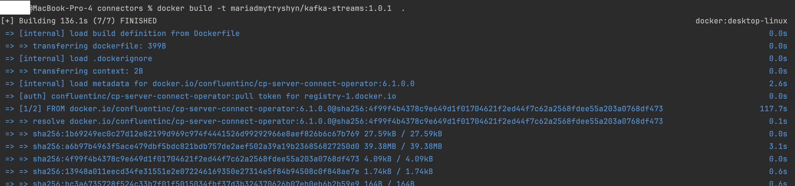
Push image
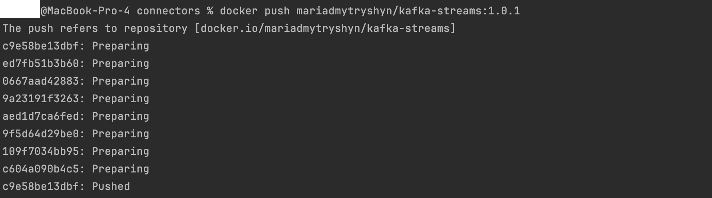

## Launch Confluent for Kubernetes

### Connect to the AKS cluster

```bash
az aks get-credentials --resource-group yourResourceGroupName --name yourClusterName
```

### Create a namespace

- Create the namespace to use:

  ```cmd
  kubectl create namespace confluent
  ```

- Set this namespace to default for your Kubernetes context:

  ```cmd
  kubectl config set-context --current --namespace confluent
  ```
  
- 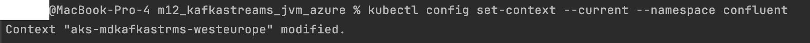


### Install Confluent for Kubernetes

- Add the Confluent for Kubernetes Helm repository:

  ```cmd
  helm repo add confluentinc https://packages.confluent.io/helm
  helm repo update
  ```

- Install Confluent for Kubernetes:

  ```cmd
  helm upgrade --install confluent-operator confluentinc/confluent-for-kubernetes
  ```
  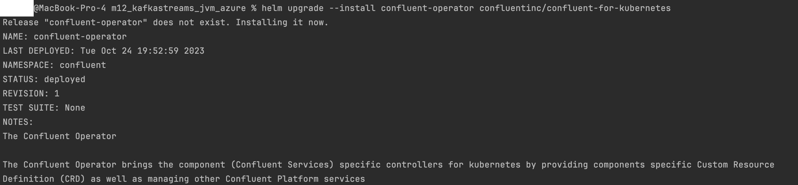


## Create your own connector's image

- Create your own connector's docker image using provided Dockerfile and use it in confluent-platform.yaml

In the `confluent-platform.yaml file` change `application: my-azure-connector:1.0.0` to `application: <LOCAL_IMAGE_NAME>`

### Install Confluent Platform

- Install all Confluent Platform components:

  ```cmd
  kubectl apply -f ./confluent-platform.yaml
  ```
  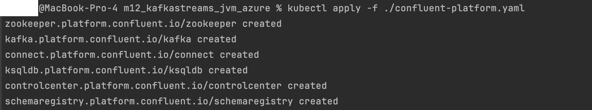

- Install a sample producer app and topic:

  ```cmd
  kubectl apply -f ./producer-app-data.yaml
  ```
  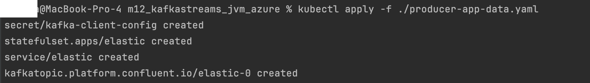

- Check that everything is deployed:

  ```cmd
  kubectl get pods -o wide 
  ```

  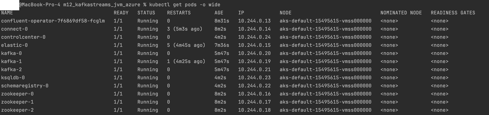


### View Control Center

- Set up port forwarding to Control Center web UI from local machine:

  ```cmd
  kubectl port-forward controlcenter-0 9021:9021
  ```

- Browse to Control Center: [http://localhost:9021](http://localhost:9021)

  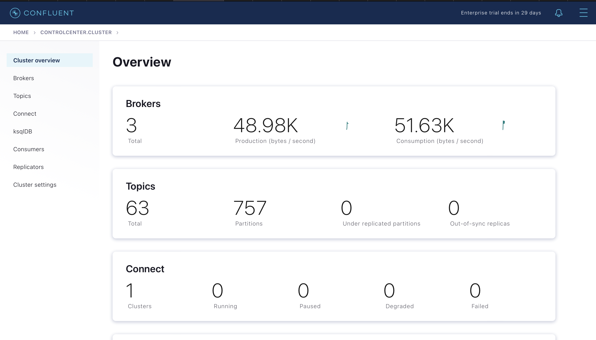


## Create kafka topics

- Create two new topics with at least 3 partitions because the azure blob storage has 3 partitions. Name new topics `expedia` and `expedia_ext`.
  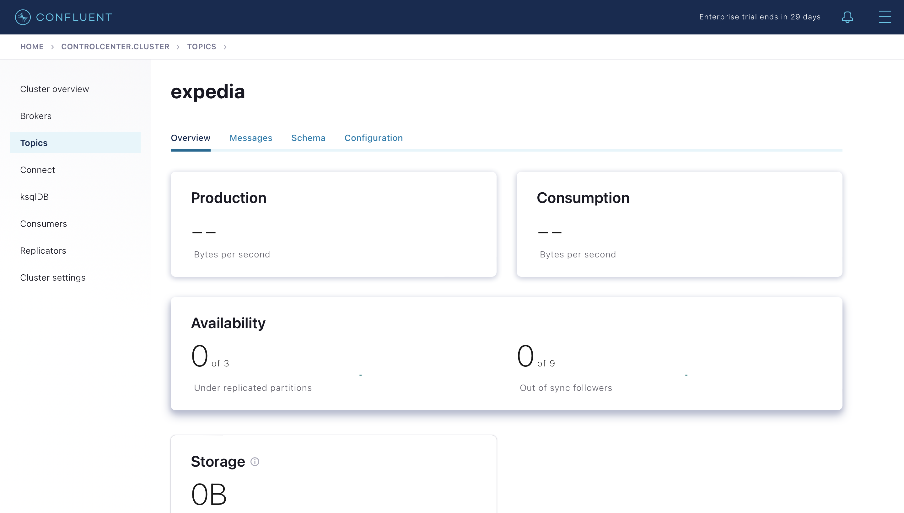

## Prepare the azure connector configuration

- Add configurations to `azure-source-cc-expedia.json` file. 

  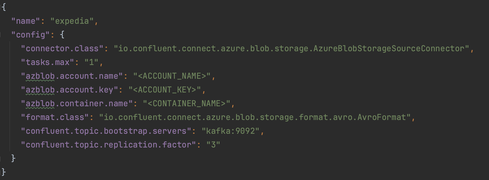


## Upload the connector file through the API

- Upload the connector using `Upload connector config file` tab and select `azure-source-cc-expedia.json` file.


  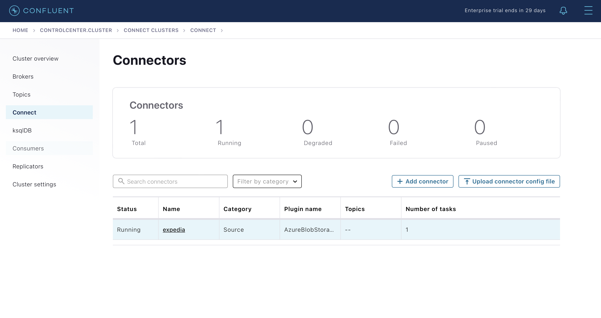

## Implement you KStream application

- Add necessary code and configuration to [KStream Application Class](src/main/java/com/epam/bd201/KStreamsApplication.java)

- Build KStream application jar
  ```cmd
  $ mvn package
  ```

  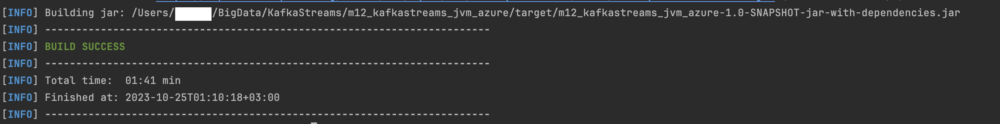


- Build [KStream Docker Image](Dockerfile) - insert valid Azure image registry here
  ```cmd
  $ docker build -t image-registry/your-project-id/kstream-app:1.0
  ```
  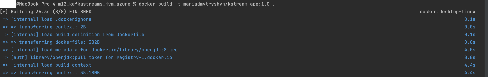


- Push KStream image to Container Registry
  ```cmd
  $ docker push image-registry/your-project-id/kstream-app:1.0
  ```
  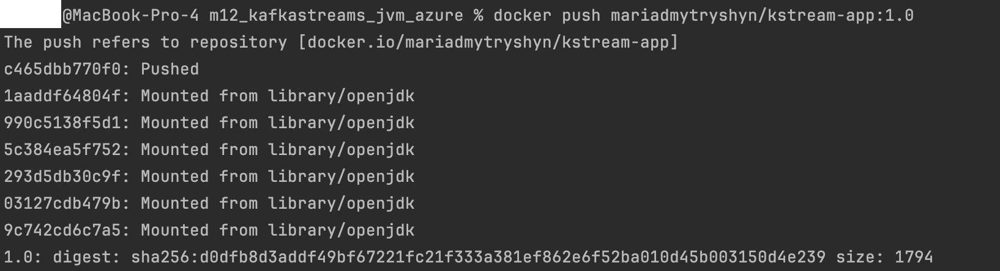


- Run you KStream app container in the K8s kluster alongside with Kafka Connect. Don't forger to update [Kubernetes deployment](kstream-app.yaml)
  with valid registry for your image
  ```cmd
  $ kubectl create -f kstream-app.yaml
  ```

  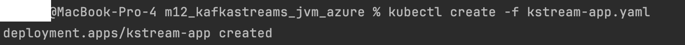

- Check the consumer is created

  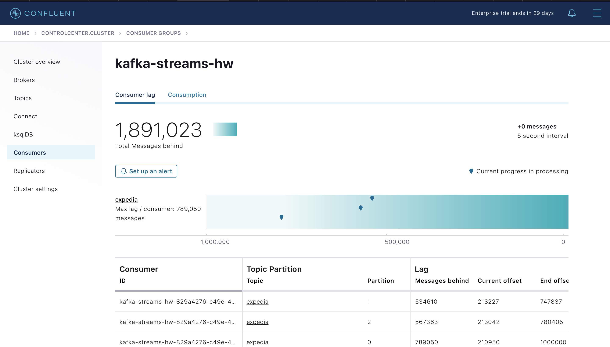

- Check the `expedia_ext` topic

  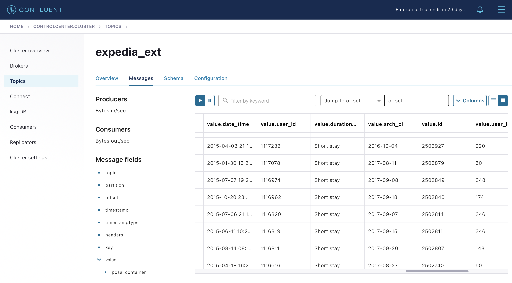

## Visualise data

- Using ksqldb, create a new stream with `hotel_id` and `duration_category` from the `expedia_ext` topic

  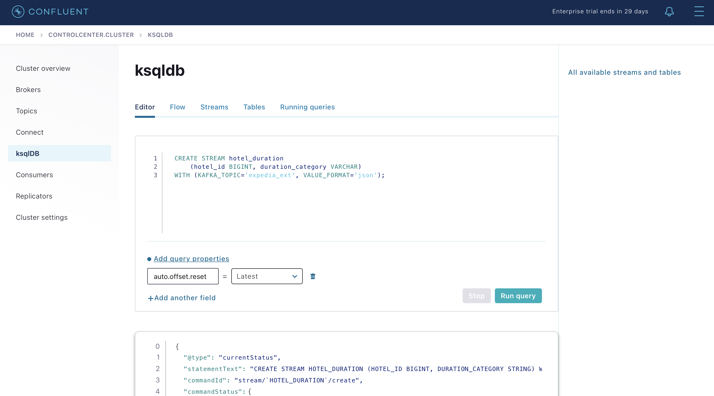


- Using ksqldb, create a `duration_hotels_agg` table with  total amount of hotels and number of distinct hotels for each category

  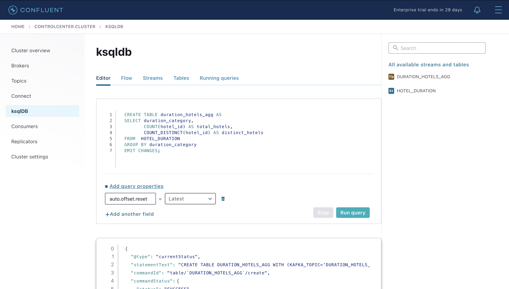


- Using kslqdb CLI, query result table

  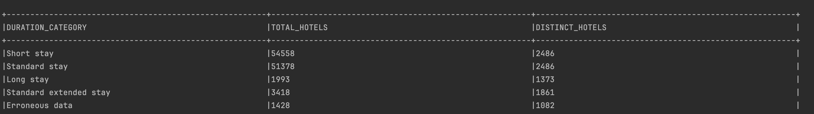


